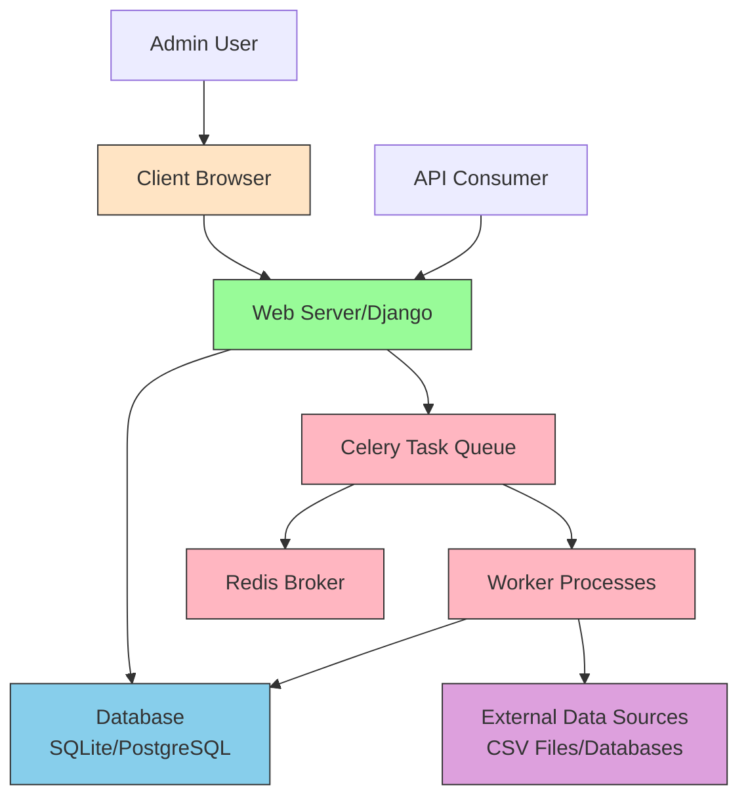
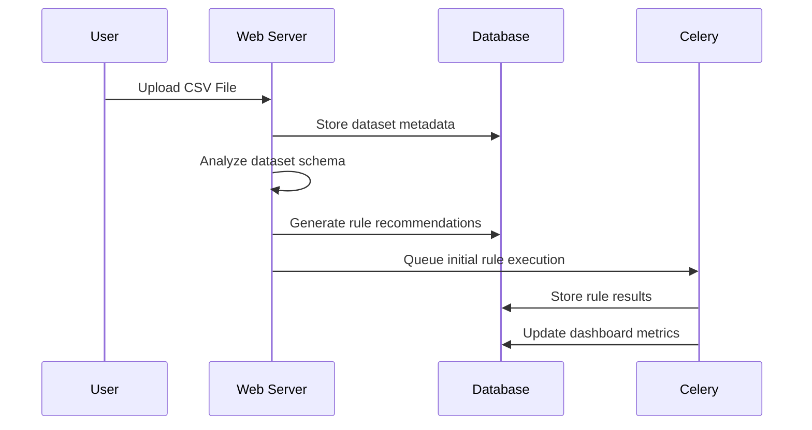
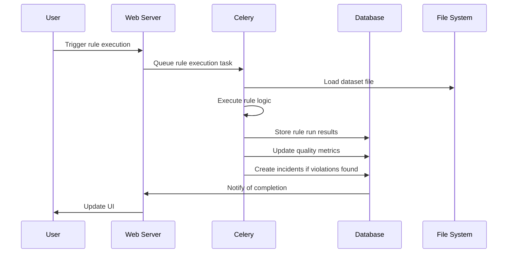
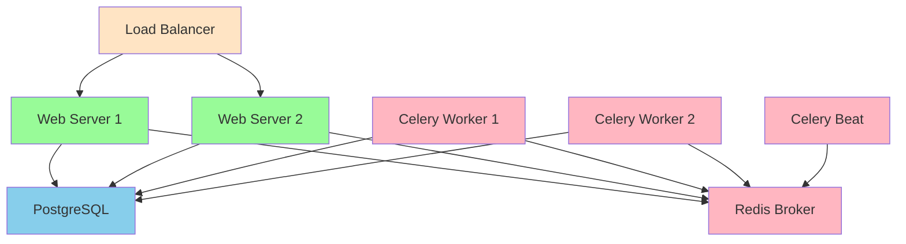

# Data Quality Watchtower - System Architecture

## Overview

Data Quality Watchtower is a comprehensive web application designed to monitor and ensure data quality across various data sources including CSV files and database tables. The system provides automated rule generation, incident tracking, and visualization capabilities to help data teams maintain high-quality datasets.

## Architecture Diagram

## System Components

### 1. Web Application Layer (Django)

The core of the application is built using Django, a high-level Python web framework that encourages rapid development and clean, pragmatic design.

#### Key Django Apps:

1. **datasets** - Manages dataset uploads, metadata, and schema information
2. **rules** - Handles data quality rule definitions, execution, and results
3. **incidents** - Tracks data quality violations and their lifecycle
4. **dashboard** - Provides visualization and analytics capabilities
5. **api** - Exposes RESTful endpoints for external integration
6. **audit** - Maintains immutable logs of system activities
7. **users** - Manages user authentication and authorization

### 2. Data Processing Layer

- **pandas** - Used for CSV parsing, data analysis, and rule execution
- **Custom DSL Parser** - Interprets domain-specific language for rule definitions
- **Rule Executor** - Applies rules to datasets and generates evidence

### 3. Background Processing Layer (Celery)

- **Task Queue** - Asynchronous processing of rule execution
- **Idempotency** - Ensures tasks can be safely retried without side effects
- **Scheduling** - Periodic rule execution and SLA checks

### 4. Data Storage Layer

- **Primary Database** - SQLite for development, PostgreSQL for production
- **Redis** - Message broker for Celery task queue
- **File Storage** - Evidence files and uploaded datasets

### 5. Frontend Layer

- **Django Templates** - Server-side rendering of HTML pages
- **Chart.js** - Data visualization for dashboards
- **Bootstrap 5** - Responsive UI components
- **Glassmorphism Design** - Modern aesthetic with frosted glass effects

## Data Flow

### Dataset Upload Process

### Rule Execution Process

## Key Features Architecture

### Rule Engine

The rule engine supports multiple rule types through a custom DSL:

- **NOT_NULL** - Ensures column values are not null
- **UNIQUE** - Validates column uniqueness
- **IN_RANGE** - Checks numeric values within specified bounds
- **MATCHES** - Validates values against regex patterns
- **FOREIGN_KEY** - Validates referential integrity
- **CUSTOM_PYTHON** - Executes custom validation functions

### Auto Rule Generation

When datasets are uploaded, the system automatically analyzes the data to suggest appropriate rules:

- Columns with low null percentage → NOT_NULL rules
- Numeric columns with consistent ranges → IN_RANGE rules
- Columns with high uniqueness → UNIQUE rules
- Pattern recognition for foreign key relationships

### Incident Management

Incidents track data quality violations with:

- Workflow states (OPEN → ACKNOWLEDGED → RESOLVED/MUTED)
- Severity levels (LOW/MEDIUM/HIGH)
- Evidence storage with sample failed records
- SLA tracking and breach notifications

### Dashboard & Visualization

The dashboard provides real-time insights through:

- Quality trend charts (pass/fail over time)
- Rule pass rates visualization
- Heatmaps for incident patterns
- Key metrics (overall quality score, violations, etc.)

## Security Architecture

### Authentication & Authorization

- Role-based access control (RBAC) with roles:
  - Admin: Full system access
  - DataEngineer: Dataset and rule management
  - Analyst: View-only access to dashboards
- Session-based authentication
- Password policies and secure storage

### Data Protection

- File encryption for sensitive datasets
- Access logging through audit trails
- Secure evidence storage with access controls

## Deployment Architecture

### Containerized Deployment (Docker)

### Scalability Patterns

- Horizontal scaling of web servers
- Multiple Celery workers for parallel processing
- Database connection pooling
- Caching strategies for frequently accessed data

## Technology Stack

### Backend
- Django 4.2+
- Django ORM
- Celery for background tasks
- Redis as message broker
- PostgreSQL (primary) / SQLite (development)
- pandas for data processing

### Frontend
- Django Templates
- Chart.js for data visualization
- Bootstrap 5 for responsive design
- Custom CSS with glassmorphism effects

### Infrastructure
- Docker for containerization
- docker-compose for orchestration
- Nginx as reverse proxy (production)
- Gunicorn as WSGI server

## API Design

### RESTful Endpoints

- `/api/dashboard/stats/` - Dashboard statistics
- `/api/rules/run/` - Trigger rule execution
- `/api/incidents/` - Incident management
- `/api/datasets/{id}/recommendations/` - Rule recommendations

### Data Models

#### Dataset
- Name, description, source type
- File path or database connection details
- Schema information and sample statistics
- Quality metrics and trend data

#### Rule
- Name, description, type
- DSL expression for validation logic
- Severity level and active status

#### RuleRun
- Execution timestamp and status
- Passed/failed counts
- Evidence storage reference

#### Incident
- Associated rule and dataset
- Severity and current status
- Evidence and resolution notes

## Monitoring & Observability

### Logging
- Structured application logs
- Audit trails for all user actions
- Performance metrics collection

### Health Checks
- Database connectivity
- Celery worker status
- Redis availability
- Disk space monitoring

## Future Enhancements

1. **Machine Learning Integration** - Anomaly detection for data quality
2. **Real-time Processing** - Stream processing capabilities
3. **Advanced Visualization** - Interactive dashboards with drill-down
4. **Multi-tenancy** - Support for multiple organizations
5. **Plugin Architecture** - Extensible rule types and integrations